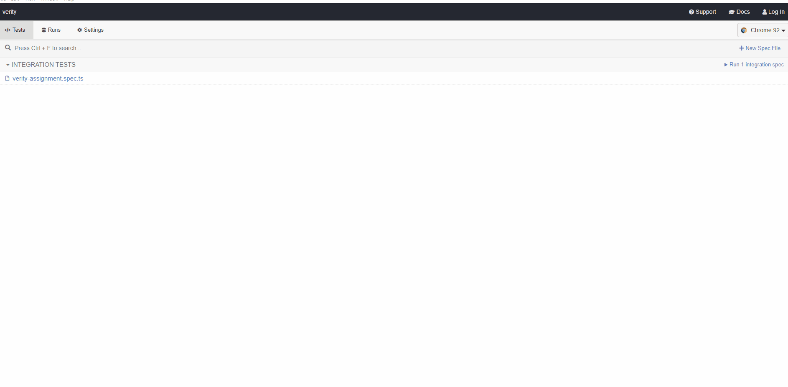

# Overview

Verity SEO test assignment

# Solution Structure

- [Cypress](./cypress) - contains test automation application

# Setup

To run the solution you will need to install:

- Node v10.15.3+

Download Node via the nvm (node version manager).

- [NVM for Windows](https://github.com/coreybutler/nvm-windows)
- [NWM for MacOS / Linux](https://github.com/nvm-sh/nvm#install--update-script)

```
// Windows
choco install nvm

// MacOS
brew install nvm
```
Run 
```
npm install
```
this will install Cypress and TypeScript

### Running Test ###

From the solution folder, go to package.json
and run script:
```
"open": "npx cypress open"
```
Once cypress runner is loaded click on the **verity-assignment.spec.ts**

